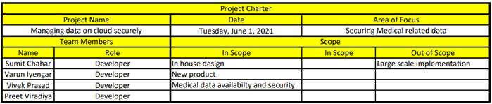

# medical_data_project
Managing all Medical related data on cloud securely

## Project Development Lifecycle:
•	Purpose  
o	To manage and store medical related data on cloud securely. 
•	Hardware 
o	Compute services that provide the right support where we can resize the compute capacity in the cloud to run application program. 
•	Storage 
o	Storage service that can backup and archive data over the internet. 
•	Network 
o	Network which can securely deliver the data on low latency and high speed. 
•	Security 
o	Enable services for user’s authentication or limiting access to set of users. 
•	Process management and tools 
o	Management and control of cloud by using management tools. 
•	Testing 
o	Testing of the complete architecture through various tools.  
•	Analyzing 
o	Data analytics and visualization, instant querying.  

## Types of Data:
•	Electronic health records  
o	Often referred to as the electronic medical record (EMR), the EMR is generally not available to outside researchers. The data collected includes administrative and demographic information, diagnosis, treatment, prescription drugs, laboratory tests, physiologic monitoring data, hospitalization, patient insurance, etc. 
•	Administrative data  
o	Often associated with electronic health records, these are primarily hospital discharge data reported to a government agency like AHRQ.
 
•	Claims data.  
o	Claims data describe the billable interactions (insurance claims) between insured patients and the healthcare delivery system. Claims data falls into four general categories: inpatient, outpatient, pharmacy, and enrollment. The sources of claims data can be obtained from the government (e.g., Medicare) and/or commercial health firms (e.g., United HealthCare). 
•	Patient / Disease registries  
o	Disease registries are clinical information systems that track a narrow range of key data for certain chronic conditions such as Alzheimer's Disease, cancer, diabetes, heart disease, and asthma. Registries often provide critical information for managing patient conditions. 
•	Health surveys  
o	In order to provide an accurate evaluation of the population health, national surveys of the most common chronic conditions are generally conducted to provide prevalence estimates. National surveys are one of the few types of data collected specifically for research purposes, thus making it more widely accessible. 
•	Clinical trials data 
o	Clinical research data may be available through national or discipline-specific organizations.  Level of access is likely restricted but available through proper channels.
 

•	Emergency contact details 
o	Ambulance contact numbers and other emergency contact details of hospitals. 

## Database Structure:
•	Doctor’s Data 
o	Details about doctors. 
•	Patient’s Data 
o	Patients’ complete details. 
•	Laboratory Data 
o	Pathology and Radiology  
•	Claims Data 
o	Health Insurance claims. 
•	Pharmacy Data  
o	Medicines details. 
•	OT Data 
o	OT details. 

## Project Phases:
•	Phase 1(Project Initiation): 
o	Proving value and feasibility of the project. 
o	Creating a project charter. 
•	Phase 2(Project Planning): 
o	Creating the project plan. 
o	Breaking down the project into activities and milestones. 
o	Creating a Gantt Chart according to the activities. 
•	Phase 3(Project Execution): 
o	Tackling down the activities and milestones as per plan. 
o	Reallocation of the resources as required. 
o	Identifying and mitigating risks. 
•	Phase 4(Project Monitoring and Control): 
o	Monitoring the progress and performance of the project. 
o	Controlling time and scope of the project. 
•	Phase 5(Project Closure): 
o	Presenting final deliverables. 
o	Conducting post-mortem and evaluation of the project. 

## Project Initiation:
•	Values: 
o	Reliable. 
o	Efficient. 
o	Easy to access. 
o	Highly Secured. 

•	Charter:
 

 
Project Planning: 
•	Activities: 
o	Designing interface. 
o	Creating/deciding storage model. 
o	Data Collection. 
o	Creating security models. 
o	Creating secured network over blockchain. 
o	Testing the security models. 

## Project Execution:

## Project Monitoring and Control:

## Project Closure:
